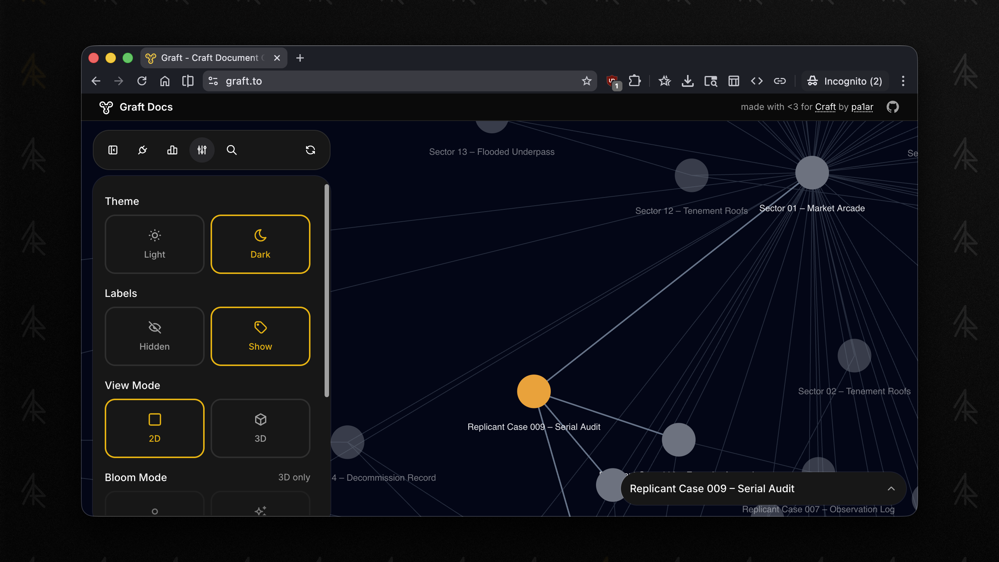
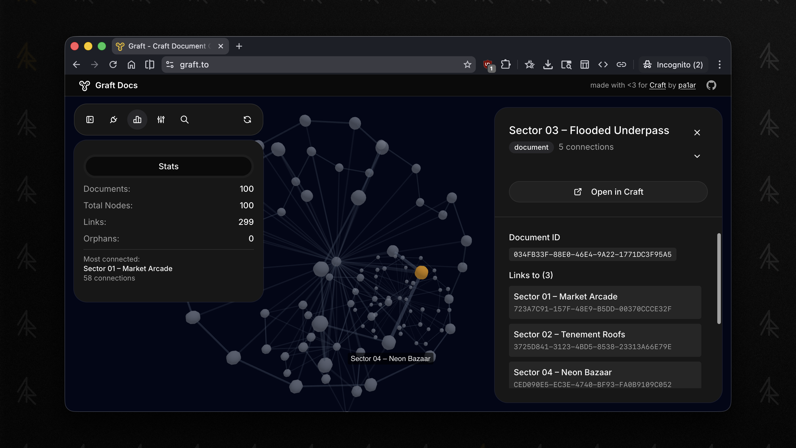
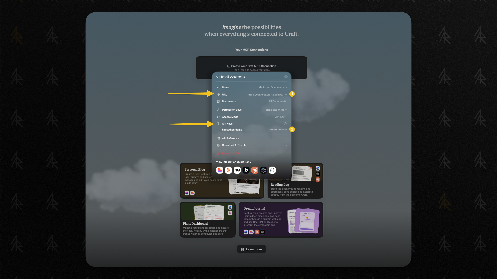
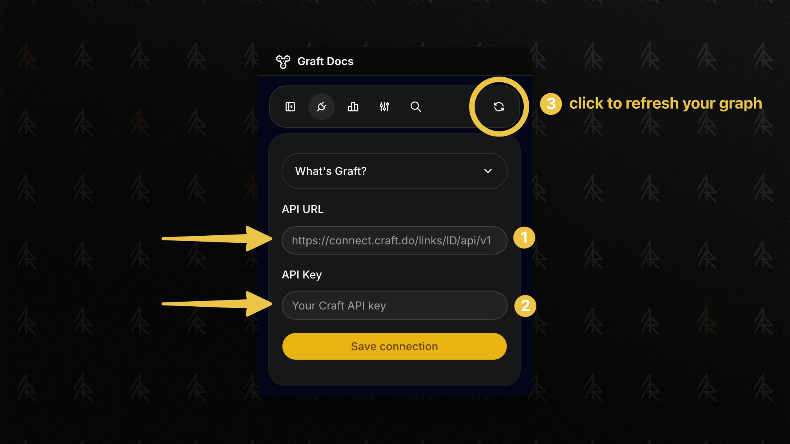

# craft_graph_view

**Graph visualization site for Craft documents**

> Graft creates an interactive graph of your Craft document connections, making it easy to see how your notes relate to each other.

[](https://graft.to) [](https://1ar.io/tools/graft) [](https://1ar.io/tools/graft)


*Interactive 2D force-directed graph showing document connections*

## Features

- **Interactive Graph**: Force-directed layout shows document relationships
- **Privacy First**: All API calls happen in your browser - neither your API URL nor the content of your notes never touches our servers
- **Progressive Fetching**: Update graph on demand without re-fetching the entire graph
- **Node Preview**: Click any node to see connections to other documents
- **Graph Statistics**: See connection counts, orphan nodes, and most-connected documents
- **Direct Links**: Open documents directly in Craft app
- **3D Visualization**: View your graph in 3D with orbit controls
- **Fun Effects**: "New Year" mode with bloom and colored nodes (pro tip: you can use it on second monitor during that holiday season 🎄)


*3D graph visualization*

## Getting Started

### Prerequisites

- A Craft account 
- Your Craft API URL (from Craft Imagine)
- Your Craft API Key (from Craft Imagine)


*Here is where you get your Craft API URL and Key in Imagine*

## How It Works

1. **Connect to Craft**: Enter your Craft API URL and Key
2. **Fetching Documents**: Retrieval will start automatically after connecting 
3. **Extracting Links**: The app will parse your notes and extract links between documents
4. **Building Graph**: The app will create nodes and edges from document relationships
5. **Visualizing**: The app will render an interactive force-directed graph
6. **Refreshing**: You can refresh the graph data and re-render the graph on demand. The app uses stored `last modified at` timestamps to perform incremental updates, only fetching documents that have changed since the last sync
7. **Disconnecting**: You can disconnect from Craft, which will remove the credentials from the browser local storage and clear the graph data
8. **Clearing Cache**: You can also just clear the cache and refresh the graph on demand, e.g. if there are issues


*Paste your Craft API credentials and click "Save connection"*

## Development 

### Running locally

Run with [bun](https://bun.sh) or npm:

```bash
# Bun
bun install
bun dev

# npm fallback
npm install --legacy-peer-deps
npm run dev
```

### Self-hosting

To deploy Graft, you can use Vercel:

1. Push to GitHub (the repo must not be public)
2. Import to Vercel via dashboard on Vercel
3. Deploy (no configuration needed - `vercel.json` handles Bun setup)

## Architecture

### Tech Stack

- **Runtime**: Next.js 16 on Bun (via Vercel)
- **Graph**: react-force-graph-2d & react-force-graph-3d
- **UI**: shadcn/ui with Craft-inspired design
- **Analytics**: Vercel Analytics

### Privacy-First Proxy

Browsers block direct requests from one domain (like `graft.to`) to another (like Craft's API) due to [CORS](https://developer.mozilla.org/en-US/docs/Web/HTTP/Guides/CORS) security policies. To work around this, Graft uses a proxy:

1. **Your browser** stores your API credentials in `localStorage` (never sent to our servers for storage)
2. **When making API calls**, your browser sends requests to our Next.js server at `/api/craft/[...path]` with your credentials in request headers
3. **Our server** immediately forwards the request to Craft's API using those credentials
4. **Craft's API** responds to our server, which then forwards the response back to your browser

Your credentials exist only in the request headers during this process - they're never logged, stored in a database, or persisted on the server. The proxy is just a pass-through that enables the browser to communicate with Craft's API.

Feel free to review our code, find bugs and create issues if you find any.

### Incremental Updates with Chronological Tracking

Graft stores document metadata (including `lastModifiedAt` timestamps) in IndexedDB. When refreshing the graph, it performs incremental updates by:

1. **Comparing timestamps**: Compares cached `lastModifiedAt` with current document timestamps
2. **Detecting changes**: Only re-fetches documents that have been modified, added, or deleted
3. **Efficient updates**: Avoids re-fetching unchanged documents, significantly reducing API calls

This enables fast refresh operations that only update what's changed since the last sync, rather than rebuilding the entire graph from scratch.

### Reusable Graph Library

The core graph processing logic lives in `lib/graph/` and is framework-agnostic. You can use the logic and build it into your own app. Or you can extract and use this library independently:

```typescript
import { createFetcher } from '@/lib/graph'

const fetcher = createFetcher(apiUrl, apiKey)
const graph = await fetcher.buildGraph({
  onProgress: (current, total, message) => {
    console.log(`${current}/${total}: ${message}`)
  }
})
```

### Project Structure

```
lib/graph/          # Standalone graph library
├── types.ts        # TypeScript types
├── parser.ts       # Link extraction and graph building
├── fetcher.ts      # Craft API client
├── cache.ts        # IndexedDB caching layer
└── index.ts        # Public exports

components/
├── graph/          # Graph visualization components
│   ├── force-graph.tsx      # 2D graph component
│   ├── force-graph-3d.tsx   # 3D graph component
│   ├── graph-controls.tsx   # Connection & settings UI
│   └── node-preview.tsx     # Node detail preview
└── ui/             # shadcn/ui components

app/
├── page.tsx        # Main graph visualization page
└── api/            # API proxy routes
    └── craft/      # Craft API proxy
```

### Security

- API credentials (URL and key) stored in browser `localStorage` only
- Credentials passed via headers, never stored on server
- Proxy route is read-only (`GET` only)
- Proxy allows only `https://connect.craft.do/links/<id>/api/v1`
- Proxy allows only safe read endpoints: `documents`, `blocks`, `collections`, `document-search`, `documents-search`
- Proxy has a basic per-IP rate limit
- AI summarize API is disabled by default (`ENABLE_AI_SUMMARIZE=true` to enable)
- No database, no data retention

### Analytics

Graft uses [Vercel Analytics](https://vercel.com/analytics) to collect anonymous usage metrics. This helps us understand how the application is being used and identify areas for improvement.

**What we collect:**
- Page views and navigation patterns
- Basic device information (browser type, screen size)
- Performance metrics (page load times, Core Web Vitals)
- Geographic region (country-level, not precise location)
- Custom events:
  - "Connection Success": Tracks when a user successfully connects to Craft API (timestamp only, no credentials or user data)
  - "Session End": Tracks session duration in seconds when user leaves the page
  - "Open in Craft": Tracks when users click to open a document in Craft app (only the click count, no document information)

**What we do NOT collect:**
- Content from your Craft documents
- Your Craft API credentials or API keys
- Document titles, IDs, or any document metadata
- Any data stored in your browser's `localStorage` or `IndexedDB`
- Personal information (names, email addresses, IP addresses)

**Privacy notes:**
- All analytics data is aggregated and anonymized
- No personal data is sent to 3rd party telemetry services
- Your Craft document content never leaves your browser
- You can block analytics using ad blockers or browser privacy settings - the application will continue to function normally

The analytics script is served from `/_vercel/insights/script.js` and may be blocked by privacy-focused browser extensions. This is expected behavior and will not affect the functionality of Graft. Feel free to review the code to check our claims. If you find any issues, please let us know.

## License

MIT

## Future Development 

I have built the project as an experiment, motivated by Craft's [winter hackathon challenge](https://documents.craft.me/Zjbc632wOHlzX6). If the project will get any significant traction, I will continue to develop it into a product, as there are many more features one can imagine to build on top of this foundation. For example: 

- RAG-based similarity graph for linking even unlinked docs
- Linking proposals based on semantic similarity
- Summaries of recent changes in your space
- Themes support (see [my Craft document](https://1ar.craft.me/graft) for inspiration images, scroll down)
- More visualization options
- Augmented reality support - imagine seeing your graph with documents and notes in your AR glasses!
